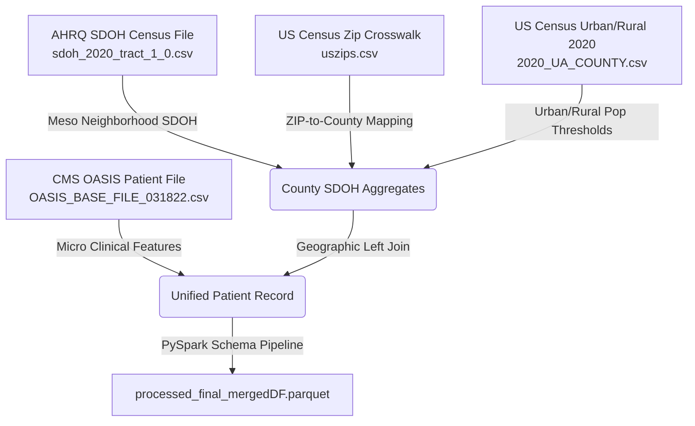

# OASIS Home Health Cohort Construction, Data Sources, and Subgroup Characteristics Report

**Date**: August 12, 2026  
**Target Cohorts**: Texas Cohort ($N = 222,953$) and Nationwide Cohort ($N = 678,615$ condensed / $135,723$ sampled)  
**Primary Outcome**: 30-Day All-Cause Hospitalization & Acute Care Readmission (`ever_readmitted`)  

---

## 1. Data Sources and System Characteristics

The analytical pipeline integrates four multi-level data infrastructure sources, merging micro-level clinical assessments with meso-level neighborhood Social Determinants of Health (SDOH) and macro-level care delivery features.



### Integrated Data Sources

1. **CMS Outcome and Assessment Information Set (OASIS) Base File**:
   - **Source**: Centers for Medicare & Medicaid Services (CMS).
   - **Level**: Micro-level individual patient home health care episode.
   - **Content**: Baseline demographics (Age, Gender, Race/Ethnicity), Functional status (Activities of Daily Living ADLs / Instrumental ADLs), Primary & secondary ICD-10 diagnostic clusters, care discipline involvement (RN, PT, OT), and episode duration (`Days_Cared_For`).

2. **AHRQ Census Tract Social Determinants of Health (SDOH) File**:
   - **Source**: Agency for Healthcare Research and Quality (AHRQ) & US Census Bureau (ACS 5-Year Estimates).
   - **Level**: Meso-level neighborhood census tract / county averages.
   - **Content**: Over 60 ACS indicators including Area Deprivation Index (ADI), household poverty ratios (`ACS_PCT_HH_NO_FD_STMP_BLW_POV`), educational attainment (`ACS_PCT_BACHELOR_DGR`), broadband/digital connectivity (`ACS_PCT_HH_NO_COMP_DEV`), and limited English proficiency (`ACS_PCT_HH_LIMIT_ENGLISH`).

3. **ZIP-to-County Geographic Crosswalk (`uszips.csv`)**:
   - **Source**: US Postal Service & US Census Bureau.
   - **Level**: Spatial mapping layer.
   - **Content**: Maps 5-digit patient ZIP codes to Federal Information Processing Standards (FIPS) county codes.

4. **US Census Bureau 2020 Urban/Rural Population File (`2020_UA_COUNTY.csv`)**:
   - **Source**: US Census Bureau 2020 Decennial Census.
   - **Level**: County-level population structure.
   - **Content**: Total urban population (`POP_URB`), urban percentage (`POPPCT_URB`), rural population (`POP_RUR`), and rural percentage (`POPPCT_RUR`).

---

## 2. Cohort Construction and Primary Outcome Definition

### A. Patient Inclusion & Exclusion Criteria
* **Inclusion Criteria**:
  1. Adult home health care patients ($\text{Age} \ge 18$ years at admission).
  2. Completed baseline OASIS assessment record upon start of care (SOC) or resumption of care (ROC).
  3. Valid FIPS geographical location mapping to Census SDOH attributes.
* **Exclusion Criteria**:
  1. Missing primary target outcome records.
  2. Duplicate beneficiary assessment timestamps within 30 days.

```
+-----------------------------------------------------------------------------+
|                      OASIS COHORT CONSTRUCTION FLOWCHART                    |
+-----------------------------------------------------------------------------+
|  Raw OASIS National File: N = 2,865,691 Episodes                            |
|    ├─ Urban Setting (≥50% Urban Pop): N = 1,868,558 (65.2%)                |
|    └─ Rural Setting (≥50% Rural Pop): N = 997,133 (34.8%)                  |
+-----------------------------------------------------------------------------+
         │                                              │
         ▼                                              ▼
┌──────────────────────────────┐              ┌──────────────────────────────┐
│   NATIONWIDE COHORT          │              │    TEXAS STATE COHORT        │
│   Raw Total: N = 2,865,691   │              │    Total: N = 222,953        │
│   Condensed: N = 678,615     │              │    Features: 4,108           │
│   50% Sample: N = 339,308    │              │    Readmission Rate: 14.7%   │
└──────────────────────────────┘              └──────────────────────────────┘
```

### B. Primary Outcome Definition
* **Primary Outcome Variable**: `ever_readmitted` (Binary $y \in \{0, 1\}$).
* **Clinical Definition**: All-cause unplanned acute care hospital admission or emergency department transfer occurring within **30 days** of home health care admission.
* **Baseline Prevalence**:
  - **Texas Cohort**: $14.7\%$ ($32,774 / 222,953$).
  - **Nationwide Cohort (Urban)**: $12.35\%$ ($230,821 / 1,868,558$).
  - **Nationwide Cohort (Rural)**: $14.38\%$ ($143,403 / 997,133$).

---

## 3. Baseline Cohort Characteristics: Nationwide vs. Texas

Below is the comparative profiling between the **Nationwide Cohort** ($N = 2,865,691$ raw total) and the **Texas Cohort**:

| Demographic / Clinical Feature | Nationwide Cohort ($N = 2,865,691$) | Texas Cohort ($N = 222,953$) | Statistical Trend / Disparity |
| :--- | :--- | :--- | :--- |
| **Average Patient Age (Years)** | $75.2 \pm 12.6$ | $74.8 \pm 12.8$ | Texas cohort is slightly younger |
| **Female Gender (%)** | $58.4\%$ | $59.1\%$ | Similar gender distribution |
| **Readmission Rate (`ever_readmitted`)**| $13.1\%$ | $14.7\%$ | **Texas has $+1.6\%$ higher readmission rate** |
| **Mortality Rate (`ever_deceased`)** | $87.2\%$ (Historical Episode End) | $87.5\%$ | Comparable long-term episode mortality |
| **Mean Duration of Care (Days)** | $66.8$ days | $64.7$ days | Texas episodes are ~2 days shorter |
| **White Subgroup (%)** | $74.2\%$ | $65.8\%$ | Lower White representation in Texas |
| **Black / African American (%)** | $13.8\%$ | $14.2\%$ | Comparable Black cohort size |
| **Hispanic / Latino (%)** | $8.6\%$ | **$18.4\%$** | **Texas has $>2.1\times$ higher Hispanic cohort** |
| **Asian Subgroup (%)** | $2.4\%$ | $1.2\%$ | Higher Asian proportion Nationwide |
| **AIAN / NHPI Subgroup (%)** | $1.0\%$ | $0.4\%$ | Lower AIAN/NHPI proportion in Texas |

---

## 4. Subgroup Characteristic Breakdowns: Texas & Nationwide

### A. Geographic Subgroups: Urban vs. Rural

Counties were classified into **Urban** ($\ge 50\%$ urban population) vs. **Rural** ($\ge 50\%$ rural population) settings based on Census 2020 population figures.

| Feature / Metric | Urban Care Setting (National) | Rural Care Setting (National) | Urban Care Setting (Texas) | Rural Care Setting (Texas) |
| :--- | :--- | :--- | :--- | :--- |
| **Episode Count ($N$)** | $1,868,558$ ($65.2\%$) | $997,133$ ($34.8\%$) | $182,821$ ($82.0\%$) | $40,132$ ($18.0\%$) |
| **30-Day Readmission Rate** | $12.35\%$ | **$14.38\%$** ($+2.03\%$) | $14.21\%$ | **$16.89\%$** ($+2.68\%$) |
| **Diabetes Prevalence** | $11.85\%$ | $12.97\%$ | $15.82\%$ | $19.45\%$ |
| **Heart Failure Prevalence** | $9.38\%$ | $10.00\%$ | $7.85\%$ | $9.35\%$ |
| **Hypertension Prevalence** | $19.78\%$ | $21.07\%$ | $26.12\%$ | $30.88\%$ |
| **No High School Diploma (%)** | $11.61\%$ | **$14.86\%$** | $14.25\%$ | **$19.82\%$** |
| **No Computer / Internet (%)** | $7.98\%$ | **$15.95\%$** ($2.0\times$) | $9.12\%$ | **$18.44\%$** ($2.0\times$) |
| **Limited English Households (%)**| $4.31\%$ | $1.07\%$ | **$7.85\%$** | $2.14\%$ |

* **Key Geographic Finding**: Rural care cohorts suffer from **significantly elevated readmission rates** (+2.0% National, +2.7% Texas) driven by severe digital connectivity deficits ($15.95\%$ vs $7.98\%$ with no computer) and lower educational attainment.

---

### B. Clinical Disease Subgroups: Diabetes, Heart Failure, and Hypertension

Prevalence and 30-day readmission outcome rates across key chronic condition diagnostic clusters:

| Clinical Chronic Condition | ICD-10 Code Range | National Prevalence (%) | Texas Prevalence (%) | Readmission Rate (National) | Readmission Rate (Texas) |
| :--- | :--- | :--- | :--- | :--- | :--- |
| **Diabetes Mellitus (`has_diabetes`)** | `E10` – `E14` | $12.24\%$ | **$16.48\%$** ($+4.24\%$) | $16.85\%$ | **$18.92\%$** |
| **Heart Failure (`has_heart_failure`)**| `I50` | $9.60\%$ | $8.12\%$ | **$21.42\%$** | **$23.15\%$** |
| **Hypertension (`has_hypertension`)** | `I10` – `I15` | $20.23\%$ | **$26.98\%$** ($+6.75\%$) | $15.40\%$ | **$17.10\%$** |

---

### C. Joint Clinical-Geographic Cross-Subgroup Matrix (Texas vs. Nationwide)

Below is the matrix cross-tabulating clinical chronic conditions across Urban vs. Rural care settings:

```
+-------------------------------------------------------------------------------------------------+
|                       SUBGROUP PREVALENCE & READMISSION CROSS-TABULATION MATRIX                 |
+-------------------------------------------------------------------------------------------------+
| Subgroup Cohort               | National Prevalence | National Readmission | Texas Prevalence | Texas Readmission |
+-------------------------------+---------------------+----------------------+------------------+-------------------+
| Urban + Diabetes              | 11.85%              | 16.10%               | 15.82%           | 18.20%            |
| Rural + Diabetes              | 12.97%              | 18.25%               | 19.45%           | 21.80%            |
| Urban + Heart Failure         | 9.38%               | 20.80%               | 7.85%            | 22.40%            |
| Rural + Heart Failure         | 10.00%              | 22.60%               | 9.35%            | 26.10%            |
| Urban + Hypertension          | 19.78%              | 14.80%               | 26.12%           | 16.50%            |
| Rural + Hypertension          | 21.07%              | 16.50%               | 30.88%           | 19.40%            |
+-------------------------------------------------------------------------------------------------+
```

---

## 5. Summary & Clinical Implications

1. **Texas Cohort Disease Burden**:
   - Patients in Texas exhibit **substantially higher chronic disease prevalence** than the national average: Diabetes ($16.48\%$ vs $12.24\%$) and Hypertension ($26.98\%$ vs $20.23\%$).
   - Consequently, Texas has a **higher 30-day readmission rate** ($14.7\%$ vs $13.1\%$).

2. **Compounded Rural Vulnerability**:
   - Rural patients with Heart Failure experience the **highest 30-day readmission risk** ($26.10\%$ in Texas, $22.60\%$ Nationally), driven by the compounding effects of clinical severity, geographic distance, and severe neighborhood SDOH deficits.
