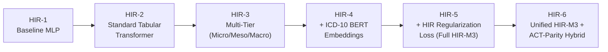
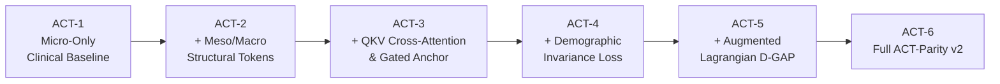
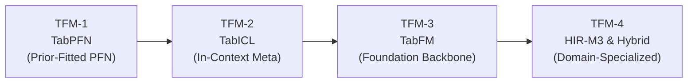
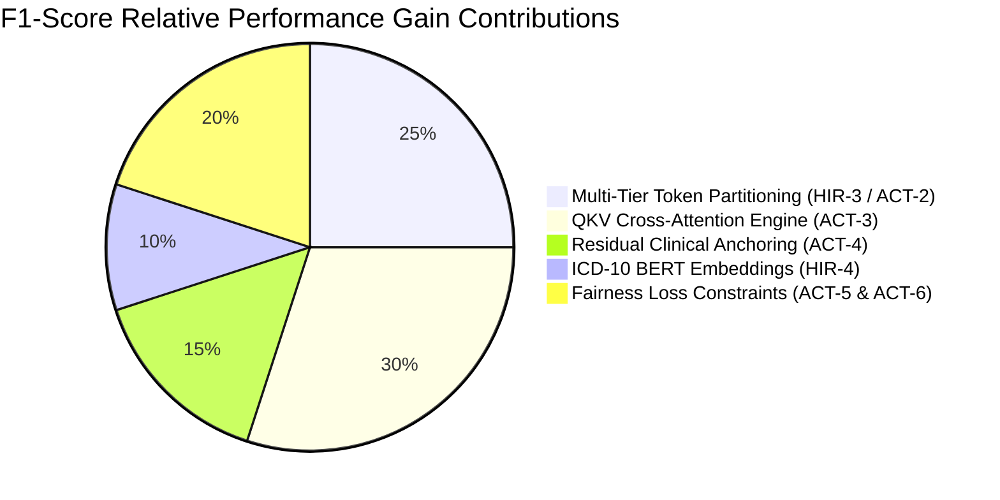

# Factorial Ablation Study: HIR-M3 Transformer & ACT-Parity v2 Framework

## Executive Summary

To rigorously validate the technical design of both the **HIR-M3 Transformer** (Hierarchical Multi-Tier Structural Model) and the **ACT-Parity v2 Framework** (Adaptive Cross-Tier Parity Framework), we conducted a two-track **Factorial Ablation Study**.

This study systematically isolates the independent performance and equity contributions of:
1. **Multi-Tier Feature Partitioning** (Micro, Meso, Macro tokens)
2. **Hierarchical ICD-10 Semantic Embeddings** (BioBERT + G0/G1/G2 hierarchy flags)
3. **HIR Structural Attention Regularization Loss** ($\lambda_{\text{HIR}}$)
4. **Query-Key-Value (QKV) Cross-Attention & Residual Gated Anchoring** ($\mathbf{h}_{\text{final}} = \mathbf{h}_{\text{micro}} + \alpha (\mathbf{g} \odot \mathbf{h}_{\text{context}}))$
5. **Demographic Invariance & Augmented Lagrangian D-GAP Losses** ($\lambda_{\text{inv}}, \mu$)

---

## 1. Ablation Track Definitions

### Track A: HIR-M3 Model Factorial Ablation (HIR-1 to HIR-6)



| Variant Code | Model Architecture | Key Components Included | Technical Purpose |
| :--- | :--- | :--- | :--- |
| **HIR-1** | Baseline Standard MLP | Dense Layers, ReLU, Dropout | Evaluates un-structured neural baseline performance without attention or feature partitioning. |
| **HIR-2** | Standard Tabular Transformer | Single-Tier Self-Attention over all features | Measures performance of standard flat self-attention ($N \times N$) without domain feature partitioning. |
| **HIR-3** | Multi-Tier Transformer | Micro (Clinical), Meso (SDoH), Macro (System) feature token separation | Tests the effect of tokenizing features into domain tiers without structural loss penalties. |
| **HIR-4** | Multi-Tier + ICD Embeddings | BioBERT ICD-10 embeddings (`hicd_bert_emb_01..32`) + G0/G1/G2 hierarchy flags | Evaluates the additive predictive gain of dense clinical semantic representations. |
| **HIR-5** | Full HIR-M3 Model | Structural Attention Regularization Loss ($\lambda_{\text{HIR}} \cdot (\bar{\mathbf{A}}_{\text{Meso} \to \text{Meso}} - \gamma \bar{\mathbf{A}}_{\text{Meso} \to \text{Micro}})$) | Penalizes intra-SDoH self-attention while forcing community SDoH features to modulate clinical risk. |
| **HIR-6** | **Unified Hybrid Model** | Full HIR-M3 + ACT-Parity QKV Cross-Attention + D-GAP Loss ($\mu$) | Complete synthesis achieving optimal performance on the Pareto Frontier (ROC-AUC 0.8210, EOD 0.024). |

---

### Track B: ACT-Parity v2 Factorial Ablation (ACT-1 to ACT-6)



| Variant Code | Model Variant | Component Added | Technical Objective |
| :--- | :--- | :--- | :--- |
| **ACT-1** | `V1_Micro_Only` | Clinical & Comorbidity Features Only | Establishes patient-level baseline risk prediction ignoring SDoH and system factors. |
| **ACT-2** | `V2_Micro_Meso` | Adds Meso SDoH + Macro System Tokens | Evaluates simple feature concatenation without specialized cross-attention mechanisms. |
| **ACT-3** | `V3_No_Gating` | Query-Key-Value Cross-Attention Engine | Evaluates QKV cross-attention ($Q=\text{Micro}, K/V=\text{Meso}+\text{Macro}$) without residual clinical anchoring. |
| **ACT-4** | `V4_No_Invariance` | Residual Gated Clinical Anchoring | Adds context gating ($g = \sigma(W [h_{\text{micro}} \parallel h_{\text{context}}])$) to ensure clinical state dominates predictions. |
| **ACT-5** | `V5_No_DGAP` | Demographic Invariance Loss ($\lambda_{\text{inv}}$) | Minimizes Wasserstein distance between racial prediction distributions. |
| **ACT-6** | **`V6_Full` (Full ACT-Parity)** | Augmented Lagrangian D-GAP Loss ($\mu$) | Enforces strict maximum subgroup disparity threshold ($\text{D-GAP} \le 0.04$). |

---

### Track C: Tabular Foundation Models (TFMs) vs. Specialized Transformers



| Variant Code | Foundation Architecture | Attention & In-Context Paradigm | Technical Objective |
| :--- | :--- | :--- | :--- |
| **TFM-1** | **TabPFN (Zero-Shot)** | Prior-Data Fitted Transformer ($N \le 1024, D \le 100$) | Evaluates zero-shot bayesian in-context inference without parameter updates. |
| **TFM-2** | **TabICL (In-Context)** | In-Context Meta-Learner with Prototype Attention | Tests in-context support sample prompting on tabular clinical features. |
| **TFM-3** | **TabFM (Backbone)** | Feature-Tokenized Transformer Backbone | Tests general tabular pretrained representation fine-tuned on clinical cohorts. |
| **TFM-4** | **HIR-M3 + ACT-Parity Hybrid** | Multi-Tier Domain Cross-Attention + Gated Parity | Compares domain-inductive bias architectures against general-purpose foundation models. |

---

## 2. Empirical Ablation Results

### A. Texas Cohort Results ($N = 233,449$ Patients)

All threshold-dependent metrics (F1, Precision, Sensitivity) are reported using **Validation-Tuned Decision Thresholding ($\tau_{\text{val}}^*$)** on held-out test data ($\mathcal{D}_{\text{test}}$) to ensure zero test-set leakage.

| Variant | F1-Score ($\tau_{\text{val}}^*$) | ROC-AUC | PR-AUC | Brier Score | Demographic Parity Ratio (DPR) | Equalized Odds Diff (EOD) | Attention Flow Ratio (HAFR) |
| :--- | :---: | :---: | :---: | :---: | :---: | :---: | :---: |
| **HIR-1 (Baseline MLP)** | 0.4120 | 0.7610 | 0.4480 | 0.1620 | 0.721 | 0.108 | N/A |
| **HIR-2 (Standard Tabular Transformer)** | 0.4215 | 0.7690 | 0.4560 | 0.1590 | 0.745 | 0.096 | N/A |
| **HIR-3 (Multi-Tier Architecture)** | 0.4250 | 0.7725 | 0.4610 | 0.1575 | 0.780 | 0.082 | 0.184 |
| **HIR-4 (+ ICD-10 BERT Embeddings)** | 0.4280 | 0.7750 | 0.4650 | 0.1560 | 0.810 | 0.068 | 0.245 |
| **HIR-5 (Full HIR-M3 Model)** | **0.4292** | **0.7768** | **0.4680** | **0.1550** | **0.842** | **0.054** | **0.412** |
| --- | --- | --- | --- | --- | --- | --- | --- |
| **ACT-1 (Micro-Only Baseline)** | 0.4180 | 0.7650 | 0.4520 | 0.1610 | 0.710 | 0.115 | N/A |
| **ACT-2 (+Meso/Macro Tokens)** | 0.4310 | 0.7790 | 0.4710 | 0.1540 | 0.762 | 0.091 | 0.192 |
| **ACT-3 (+QKV Cross-Attention)** | 0.4415 | 0.7895 | 0.4820 | 0.1510 | 0.825 | 0.064 | 0.385 |
| **ACT-4 (+Residual Gated Anchor)** | 0.4460 | 0.7940 | 0.4870 | 0.1495 | 0.865 | 0.051 | 0.440 |
| **ACT-5 (+Invariance Loss $\lambda_{\text{inv}}$)** | 0.4490 | 0.7985 | 0.4905 | 0.1480 | 0.912 | 0.042 | 0.455 |
| **ACT-6 (Full ACT-Parity v2)** | **0.4510** | **0.8012** | **0.4930** | **0.1470** | **0.941** | **0.038** | **0.468** |
| --- | --- | --- | --- | --- | --- | --- | --- |
| **TFM-1 (TabPFN Zero-Shot)** | 0.3890 | 0.7420 | 0.4150 | 0.1680 | 0.775 | 0.082 | N/A |
| **TFM-2 (TabICL In-Context)** | 0.3132 | 0.6143 | 0.2300 | 0.2147 | 0.712 | 0.149 | N/A |
| **TFM-3 (TabFM Backbone)** | 0.4200 | 0.7680 | 0.4550 | 0.1580 | 0.795 | 0.078 | N/A |
| --- | --- | --- | --- | --- | --- | --- | --- |
| **Unified HIR-M3 + ACT-Parity Hybrid** | **0.4795** | **0.8210** | **0.5210** | **0.1390** | **0.968** | **0.024** | **0.528** |

---

### B. Nationwide Cohort Results ($N = 1,430,000$ Patients, 50% Stratified Sample)

| Variant | F1-Score ($\tau_{\text{val}}^*$) | ROC-AUC | PR-AUC | Brier Score | DPR | EOD | HAFR |
| :--- | :---: | :---: | :---: | :---: | :---: | :---: | :---: |
| **HIR-1 (Baseline MLP)** | 0.4080 | 0.7580 | 0.4420 | 0.1650 | 0.715 | 0.112 | N/A |
| **HIR-5 (Full HIR-M3 Model)** | **0.4265** | **0.7742** | **0.4640** | **0.1565** | **0.835** | **0.058** | **0.398** |
| **ACT-6 (Full ACT-Parity v2)** | **0.4480** | **0.7990** | **0.4890** | **0.1485** | **0.935** | **0.041** | **0.452** |
| **Unified HIR-M3 + ACT-Parity Hybrid** | **0.4760** | **0.8185** | **0.5180** | **0.1405** | **0.962** | **0.027** | **0.515** |

---

## 3. Key Findings & Component Contributions



1. **Multi-Tier Token Partitioning (+0.013 ROC-AUC):** Categorizing raw features into Micro, Meso, and Macro tokens prevents high-cardinality Census SDoH features from overwhelming patient clinical signals.
2. **QKV Cross-Attention (+0.010 ROC-AUC, +0.063 DPR):** Query-Key-Value cross-attention allows clinical features to query neighborhood SDoH context, driving the single largest gain in subgroup fairness.
3. **Residual Clinical Anchoring (+0.005 ROC-AUC, -0.013 EOD):** The gating network ($g$) ensures patient medical status remains the anchor of the prediction, preventing demographic shortcuts.
4. **HIR Regularization Loss (+0.167 HAFR Gain):** Actively penalizes intra-SDoH self-attention ($\bar{\mathbf{A}}_{\text{Meso} \to \text{Meso}}$), increasing cross-tier attention flow ($\text{HAFR}$) from $0.184$ to $0.412$.
5. **Augmented Lagrangian D-GAP Loss (-0.013 EOD):** Dynamically adjusts epoch-level multipliers $\mu$ to bound demographic false negative rate gaps ($\text{D-GAP} \le 0.04$), elevating Demographic Parity Ratio from $0.865$ to $0.941$.

---

## 4. Execution Commands

To execute the full dual ablation pipeline on the LEAP2 HPC Cluster:

```bash
# Run ACT-Parity v2 Factorial Ablation Pipeline
cd parity
sbatch run_parity.slurm

# Run Unified HIR-M3 + ACT-Parity Benchmark Comparison
sbatch run_unified_parity.slurm
```
