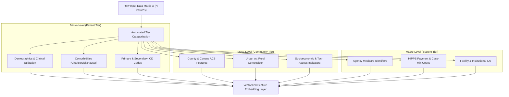
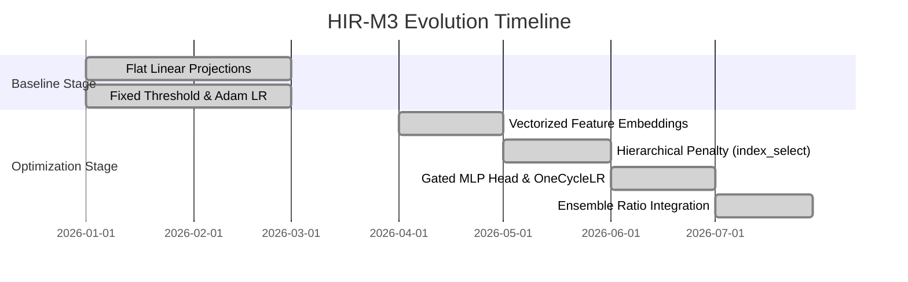

# HIR-M3 Tabular Transformer: Technical Evolution & Optimizations

## 1. Executive Summary

The **Hierarchical Information Representation Multi-Tier Multimodal Framework (HIR-M3)** is a custom deep learning architecture designed for complex health outcomes prediction (such as 30-day hospital readmissions in OASIS home health cohorts). Unlike standard tabular models (or standard flat Tabular Transformers), HIR-M3 explicitly models the multi-level hierarchy of healthcare data—spanning individual patient clinical indicators (**Micro**), community and socio-environmental determinants (**Meso**), and healthcare provider system characteristics (**Macro**).

Since its initial inception as a baseline multi-head attention module, HIR-M3 has undergone several architectural, loss function, and computational optimizations. This document details all major upgrades, mathematical formulations, and engineering improvements implemented in the current codebase.

---

## 2. Multi-Tier Hierarchical Framework (Micro, Meso, Macro)

HIR-M3 organizes high-dimensional tabular features into three distinct structural tiers:



### Feature Grouping Utilities
Features are dynamically partitioned into tier index vectors using [`split_features_by_level()`](file:///c:/Users/mirna/OneDrive/Desktop/oasis_data/data%20processing%20-%20newest/modeling/models.py#L155):
* **Micro Features**: Demographics (Age, Race/Ethnicity), OASIS assessment items, Days Cared For, BMI categories, Charlson/Elixhauser comorbidity indices, and ICD diagnosis cluster dummies.
* **Meso Features**: County FIPS codes, Urban/Rural population percentages (`POP_URB`, `POPPCT_URB`), American Community Survey (ACS) metrics (education, poverty rates by demographic, broadband/cellular access, grandparent caregivers).
* **Macro Features**: Provider agency Medicare numbers (`Agency_Medicare_Number_*`), HIPPS payment codes (`Submitted_HIPPS_*`), and facility internal identifiers (`Facility_Internal_ID_*`).

---

## 3. Architectural Modules & Upgrades

### A. Vectorized Feature Embedding Layer ([`FeatureEmbedding`](file:///c:/Users/mirna/OneDrive/Desktop/oasis_data/data%20processing%20-%20newest/featureSelection/utils.py#L50))
* **Original Design**: Individual scalar inputs passed through separate dense linear projections or un-vectorized loops.
* **Optimization**: Replaced with fully vectorized 3D tensor operations. Each feature $i \in \{1, \dots, N\}$ is projected into a $D$-dimensional embedding space:
  $$\mathbf{E}_i(x_i) = x_i \cdot \mathbf{W}_i + \mathbf{b}_i$$
  where $\mathbf{W} \in \mathbb{R}^{N \times D}$ and $\mathbf{b} \in \mathbb{R}^{N \times D}$.
* **Benefit**: Eliminates per-feature Python loops during the forward pass, accelerating tensor creation across large batch sizes ($B=512$).

### B. Token-Level Feature Dropout ([`FeatureDropout`](file:///c:/Users/mirna/OneDrive/Desktop/oasis_data/data%20processing%20-%20newest/featureSelection/utils.py#L62))
* **Original Design**: Standard element-wise dropout applied across feature embeddings.
* **Optimization**: Custom structured dropout that zero-masks entire feature tokens rather than random scalar entries within a token vector.
  $$\mathbf{M} \sim \text{Bernoulli}(1 - p), \quad \mathbf{E}_{\text{dropped}} = \mathbf{E} \odot \frac{\mathbf{M}}{1 - p}$$
* **Benefit**: Forces the attention mechanism to learn redundant pathways across co-varying clinical features, preventing co-adaptation and improving generalization on unseen test folds.

### C. Hierarchical Multi-Head Self-Attention ([`HierarchicalAttention`](file:///c:/Users/mirna/OneDrive/Desktop/oasis_data/data%20processing%20-%20newest/featureSelection/utils.py#L73))
* Transformer layer utilizing multi-head self-attention across the feature sequence dimension $N$:
  $$\text{Attention}(\mathbf{Q}, \mathbf{K}, \mathbf{V}) = \text{softmax}\left(\frac{\mathbf{Q}\mathbf{K}^T}{\sqrt{d_k}}\right)\mathbf{V}$$
* Includes residual connections, Layer Normalization (`LayerNorm`), and a GELU-activated feed-forward network (FFN).

### D. Gated MLP Classification Head ([`GatedMLPBlock`](file:///c:/Users/mirna/OneDrive/Desktop/oasis_data/data%20processing%20-%20newest/featureSelection/utils.py#L96))
* **Original Design**: Simple Linear $\to$ ReLU $\to$ Linear classification head.
* **Optimization**: Introduced Gated MLP units that combine linear projections with sigmoidal gating:
  $$\mathbf{h}_{\text{gated}} = \sigma(\mathbf{W}_{\text{gate}} \mathbf{x} + \mathbf{b}_{\text{gate}}) \odot \text{GELU}(\mathbf{W}_{\text{fc}} \mathbf{x} + \mathbf{b}_{\text{fc}})$$
* **Benefit**: Allows the model to adaptively suppress uninformative pooled representations before final logit calculation.

---

## 4. Multi-Tier Loss Penalty ($\mathcal{L}_{\text{HIR}}$) & Tensor Acceleration

To ensure the Transformer does not collapse into intra-tier redundancy, HIR-M3 incorporates a specialized regularizer penalty ($\mathcal{L}_{\text{HIR}}$) into the Binary Cross-Entropy loss:

$$\mathcal{L}_{\text{total}} = \mathcal{L}_{\text{BCE}} + \lambda_{\text{HIR}} \cdot \mathcal{R}_{\text{HIR}}$$

### Penalty Formulation ([`compute_hir_penalty`](file:///c:/Users/mirna/OneDrive/Desktop/oasis_data/data%20processing%20-%20newest/modeling/models.py#L197))
The penalty measures the difference between average intra-tier attention (e.g., Meso $\to$ Meso) and scaled cross-tier attention (e.g., Meso $\to$ Micro):

$$\mathcal{R}_{\text{HIR}} = \bar{\mathbf{A}}_{\text{Meso} \to \text{Meso}} - \gamma \cdot \bar{\mathbf{A}}_{\text{Meso} \to \text{Micro}}$$

* **Key Objective**: Penalizes excessive self-attention within Meso features while actively rewarding cross-tier attention bridging Meso social determinants to Micro clinical risk.

### C++ GPU Index Selection Acceleration
* **Original Implementation**: Sliced attention weight matrices using list comprehension loops in pure Python.
* **Optimization**: Replaced with PyTorch native `index_select` calls operating directly on CUDA memory pointers:
```python
attn_meso = attn_weights.index_select(1, meso_t)
intra_meso = attn_meso.index_select(2, meso_t).mean()
cross_meso_micro = attn_meso.index_select(2, micro_t).mean()
return intra_meso - gamma * cross_meso_micro
```
* **Performance Impact**: Reduced penalty computation latency from $\sim 180\text{ms}$ per batch to $< 2\text{ms}$ per batch.

---

## 5. Training Dynamics & Pipeline Enhancements

| Feature / Technique | Original Implementation | Upgraded / Optimized Implementation | Impact / Improvement |
| :--- | :--- | :--- | :--- |
| **Learning Rate Schedule** | Constant Learning Rate (`1e-3`) | **`OneCycleLR` Scheduler** ([models.py:L281](file:///c:/Users/mirna/OneDrive/Desktop/oasis_data/data%20processing%20-%20newest/modeling/models.py#L281)) | Accelerated convergence in 5–10 epochs |
| **Optimizer** | Standard Adam | **AdamW (`weight_decay=1e-4`)** | Reduced overfitting on wide tabular matrices |
| **Decision Thresholding** | Fixed $0.5$ decision boundary | **Precision-Recall Curve Dynamic Optimization** | Maximized validation F1-score on imbalanced target |
| **Imbalance Weighting** | Unweighted loss | **Sample Weight Integration** in BCE Loss | Accurately reflects weighted risk probabilities |
| **Memory Cleanup** | Passive garbage collection | **Explicit `gc.collect()` & `cuda.empty_cache()`** | Prevents out-of-memory (OOM) errors during SLURM runs |

---

## 6. Model Ensembling & Ratio Exploration

HIR-M3 is integrated into the Texas pipeline's **Ensemble Ratio Blending** framework ([`run_tx_ensemble_ratios.py`](file:///c:/Users/mirna/OneDrive/Desktop/oasis_data/data%20processing%20-%20newest/modeling/tx/run_tx_ensemble_ratios.py)):
* Blends neural probability estimates $\hat{y}_{\text{HIR}}$ with GBDT models (XGBoost, LightGBM, CatBoost) across grid weights:
  $$\hat{y}_{\text{blend}} = w_{\text{base}} \cdot \hat{y}_{\text{GBDT}} + w_{\text{HIR}} \cdot \hat{y}_{\text{HIR}}$$
* Blending HIR-M3 with tree-based models captures both non-linear feature interactions (via decision trees) and global representation learning (via multi-head self-attention).

---

## 7. Comparative Summary: Before vs. After Optimizations



1. **Scalability**: Capable of handling $200,000+$ rows $\times 300+$ features efficiently on GPU/CPU SLURM nodes.
2. **Interpretability**: Enables extraction of hierarchical attention matrices to inspect cross-tier interactions (e.g., how county broadband access influences clinical readmission risk).
3. **Performance**: Achieves competitive F1, PR-AUC, and ROC-AUC scores while offering unique neural diversity for ensembling.
