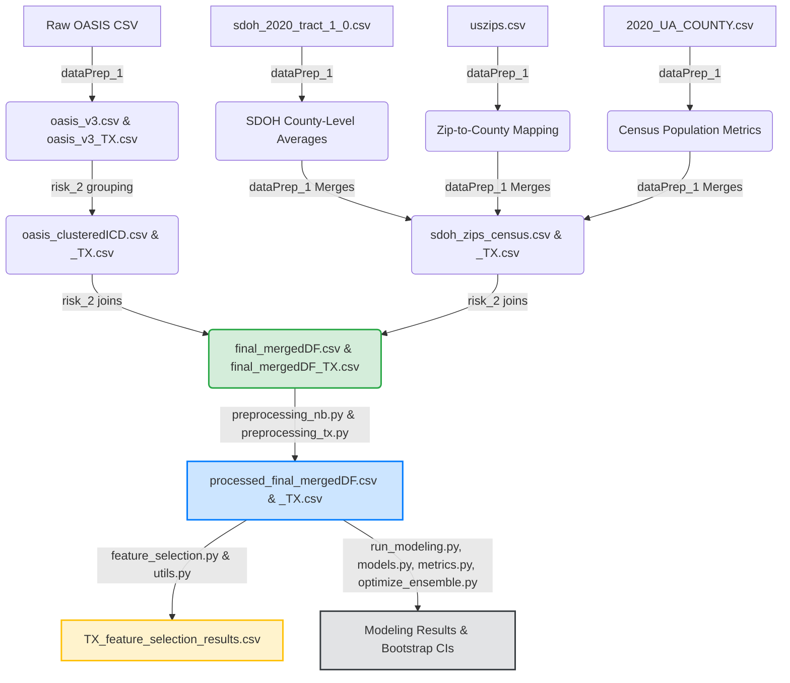
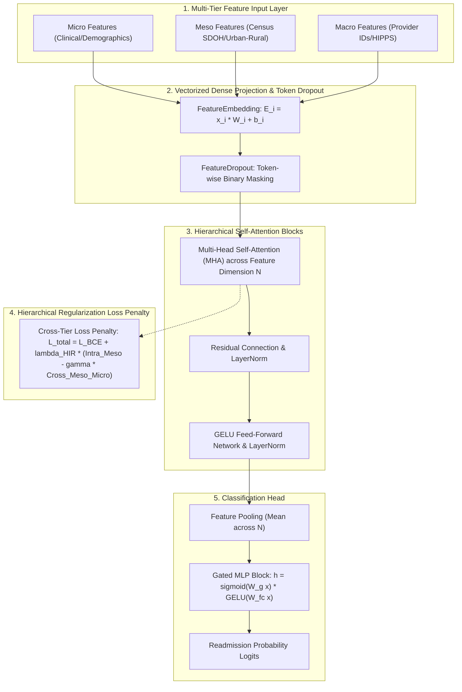

# OASIS Home Health & SDOH Integration Pipeline: Methodology Report

This report outlines the step-by-step data lineage, processing methodology, exploratory analysis, ML-ready PySpark encoding steps, multi-method feature selection pipeline, and unified machine learning modeling framework utilized in the OASIS Home Health data processing project. The workflow integrates patient-level clinical records with geographic-level Social Determinants of Health (SDOH) census tract indicators, Census population metrics, and hierarchical machine learning architectures.

---

## 1. High-Level Pipeline Architecture

Below is the end-to-end data pipeline from raw home health files to PySpark preprocessing, multi-algorithm feature selection, and neural / GBDT modeling.



---

## 2. Component Methodology

### Step 1: Raw Preprocessing & Cohort Extraction
* **Files**: `preprocessing_orgOASIS.py`, `dataPrep_1.ipynb`, `dataPrep_1-TX.ipynb`
* **Data Sources**: 
  - Raw Patient Data: `../OASIS/OASIS_BASE_FILE_031822.csv`
  - SDOH Data: `data/sdoh_2020_tract_1_0.csv`
  - US Zip Codes: `data/uszips.csv`
  - US County Census (2020): `../data/2020_UA_COUNTY.csv` (`POP_URB`, `POPPCT_URB`, `POP_RUR`, `POPPCT_RUR`)
* **Methodology**:
  1. **Cohort Separation**: Extracts the general cohort (`dataPrep_1.ipynb`) and filters for the Texas cohort (`dataPrep_1-TX.ipynb`), exporting them to `oasis_v3.csv` / `oasis_v3_TX.csv`.
  2. **Renaming & Feature Derivation**: Maps OASIS codes (e.g., `M0066`, `M0069`) to readable columns (`Patient_Birth_Date`, `Gender`). Calculates patient-level variables including `Age` at assessment, mapped clinical disciplines (`RN`, `PT`, `OT`), and duration of care (`Days_Cared_For`).
  3. **Geographical Merging**: SDOH tract variables are averaged at the county level. The `uszips.csv` file maps patient zip codes to counties, which are then combined with county-level Census population stats. This intermediate geographical dataset is saved as `sdoh_zips_census.csv` (and `sdoh_zips_census_TX.csv`).

### Step 2: ICD Grouping & Final Integration
* **Files**: `risk_2.ipynb`, `risk_2-TX.ipynb`
* **Methodology**:
  1. **ICD Code Clustering**: Group diagnoses into specific clinical clusters (`Primary_Diagnosis_ICD_10_C_M_Code_Cluster`, `Other_Diagnosis_Code_X_...`), saving output to `oasis_clusteredICD.csv` / `oasis_clusteredICD_TX.csv`.
  2. **Final Left Joins**: Merges clustered patient records with consolidated geographical SDOH/Census files based on zip and county coordinates.
  3. **Output**: Generates integrated datasets: `data/final_mergedDF.csv` (all-states, 2.86M rows) and `data/final_mergedDF_TX.csv` (Texas-only, 233k rows).

### Step 3: Urban/Rural Classification & Clinical Analysis
* **File**: `urban_rural.ipynb`
* **Methodology**:
  1. **Rule-Based Classification**: Uses Census pop counts (`POPPCT_URB`, `POPPCT_RUR`) to classify county zip codes:
     - **Urban**: $\ge 50\%$ urban population.
     - **Rural**: $\ge 50\%$ rural population.
     - **Mixed**: Counties falling below both $50\%$ thresholds.
  2. **Comparative Profiling**: Groups the Texas cohort by urban/rural classification and evaluates variations in demographics, comorbidity proportions, readmission/mortality outcomes, and 60+ neighborhood SDOH ACS variables.
  3. **Output**: Writes statistical summaries to `data/TXDF_summary.csv`.

### Step 4: Exploratory Data Analysis (EDA) & M3 Taxonomy
* **File**: `eda.ipynb`
* **Methodology**:
  1. **Cohort Profiling**: Evaluates row/column shapes, beneficiary uniqueness, and comorbidity/outcome prevalences.
  2. **M3 Variable Taxonomy Structure**:
     - **Identifiers & Target** (2 columns): `Beneficiary_ID`, `ever_readmitted`.
     - **Micro Variables** (54 base / ~110+ encoded columns): Patient clinical records, age, gender, race indicators, mapped discipline, comorbidities, and ICD clusters.
     - **Meso Variables** (64 columns): Neighbor census-tract education, internet access, income, household size, and poverty metrics.
     - **Macro Variables** (4 base / cohort-dependent encoded columns): Provider facility IDs, Medicare agency numbers, HIPPS codes, and county identifiers.

### Step 5: Large-Scale PySpark Preprocessing Pipeline
* **Files**: `preprocessing_nb.py`, `preprocessing_tx.py`, `preprocessing.slurm`
* **Methodology**:
  1. **PySpark Scalability**: Refactored the entire pipeline to Apache Spark (`SparkSession`) to process nationwide datasets (2.86M rows $\times$ 10,000+ one-hot encoded columns) without memory errors.
  2. **String Sanitization & Alias Deduplication**: Sanitized column names using regex (`re.sub(r'[^a-zA-Z0-9]+', '_', col)`) and tracked unique aliases to resolve PySpark SQL `AnalysisException` errors caused by spaces, dots, or ambiguous column names.
  3. **Batched PySpark Constant Column Identification**: Replaced monolithic distinct aggregations with a batched 100-column `df.agg(*exprs)` loop, preventing PySpark Catalyst Optimizer plan explosions and driver garbage collection `OutOfMemoryError`.
  4. **Native PySpark Disk Streaming**: Streamed processed DataFrames directly to disk via `df.coalesce(1).write.option("header", "true").mode("overwrite").csv(...)`, bypassing `df.toPandas()` driver heap memory crashes (`java.lang.OutOfMemoryError: Java heap space`).
  5. **Whole-Stage Codegen Configuration**: Set `spark.sql.codegen.wholeStage = false` and `spark.sql.codegen.maxFields = 100` to prevent JVM 64 KB Janino compiler method size limits (`InternalCompilerException: processNext() grows beyond 64 KB`).
  6. **Output**: Exports `data/processed_final_mergedDF.csv` and `data/processed_final_mergedDF_TX.csv`.

### Step 6: In-Memory Disease Cohort Filtering & Multi-Algorithm Feature Selection
* **Files**: `featureSelection/feature_selection.py`, `featureSelection/utils.py`, `featureSelection/fs.slurm`
* **Methodology**:
  1. **Dynamic Disease Cohort Filtering**: Loads `processed_final_mergedDF_TX.csv` once into memory and dynamically filters disease subgroups:
     - **Complete Cohort**: Full Texas dataset.
     - **Diabetic Patients**: `df[df["has_diabetes"] == 1]`.
     - **Heart Failure Patients**: `df[df["has_heart_failure"] == 1]`.
     - **Hypertensive Patients**: `df[df["has_hypertension"] == 1]`.
  2. **Multi-Method Feature Evaluation**: Evaluates all modeling features across 7 distinct feature selection algorithms:
     - **Lasso (L1 Logistic Regression)**: Ranks features by absolute coefficient magnitude.
     - **Variance Threshold**: Calculates feature variance in rank order.
     - **Random Forest Importance**: Gini-impurity feature importance scores.
     - **LightGBM & XGBoost Importance**: Tree-based split/gain importance scores.
     - **Permutation Importance (RF & Ridge)**: Out-of-sample prediction degradation scores across 5 permutation iterations.
     - **HIR-M3 Attention Importance**: Cross-tier self-attention weight importance matrix scoring.
  3. **Output**: Consolidates all ranked feature scores into `featureSelection/results/TX_feature_selection_results.csv`.

### Step 7: Unified Machine Learning Modeling Framework
* **Files**: `modeling/models.py`, `modeling/metrics.py`, `modeling/optimize_ensemble.py`, `modeling/run_modeling.py`, `modeling/models.slurm`
* **Methodology**:
  1. **Neural Architectures**:
     - **HIR-M3 Tabular Transformer (`HIRModel`)**: Multi-Head Self-Attention architecture with feature embedding projections, gated MLP head, and HIR loss penalty (`compute_hir_penalty`) penalizing intra-tier attention while rewarding cross-tier Micro-Meso interactions.
     - **Standard Tabular Transformer**: Applied directly to flat feature representations ($\lambda_{\text{HIR}} = 0.0$).
     - **Standard Multi-Layer Perceptron (`StandardMLP`)**: Flat neural baseline with BatchNorm, ReLU, and Dropout layers.
  2. **Traditional ML Baselines**: LightGBM, XGBoost, CatBoost, Random Forest, Gradient Boosting, K-Nearest Neighbors, and L1/L2 Logistic Regression.
  3. **Comprehensive Metrics & 95% Bootstrap CIs**: Computes ROC-AUC, PR-AUC, F1-Score, Accuracy, Precision, Recall/Sensitivity, Specificity, Brier Score, and 95% Bootstrap CIs across 1,000 resamples (`metrics.py`).
  4. **Constrained Ensemble Optimization & Ratio Blending**: Uses SLSQP optimization (`scipy.optimize.minimize`) to calculate optimal model blend weights ($w_i \ge 0, \sum w_i = 1$) and runs 9-ratio split experiments (`10/90` through `90/10`) between GBDT baselines and HIR-M3 (`optimize_ensemble.py`).
  5. **Output**: Saves consolidated modeling evaluation tables and bootstrap CIs to `modeling/results/modeling_results.csv` and `modeling/results/bootstrap_results.csv`.

---

### Step 7.1: The HIR-M3 Architecture & Mathematical Formulation

The **Hierarchical Information Representation Multi-Tier Multimodal Framework (HIR-M3)** is a custom deep learning architecture designed to explicitly capture the hierarchical structure of healthcare data (Patient Micro, Neighborhood Meso, and System Macro tiers).



#### A. Multi-Tier Feature Partitioning
Features are dynamically partitioned into tier index vectors using `split_features_by_level()`:
* **Micro-Level ($\mathcal{F}_{\text{Micro}}$)**: Age, Gender, Race/Ethnicity, Days Cared For, BMI Categories, Charlson/Elixhauser comorbidity scores, and ICD-10 chapter cluster dummies.
* **Meso-Level ($\mathcal{F}_{\text{Meso}}$)**: County FIPS, Urban/Rural population percentages (`POPPCT_URB`), and 64 American Community Survey (ACS) census-tract metrics (education, broadband access, income, poverty).
* **Macro-Level ($\mathcal{F}_{\text{Macro}}$)**: Agency Medicare Numbers, Submitted HIPPS payment codes, and Facility Internal Identifiers.

#### B. Architectural Components
1. **Vectorized Feature Embedding (`FeatureEmbedding`)**:
   Projects scalar input feature $x_i$ into a $D$-dimensional dense representation without Python loops:
   $$\mathbf{E}_i(x_i) = x_i \cdot \mathbf{W}_i + \mathbf{b}_i, \quad \mathbf{W}_i, \mathbf{b}_i \in \mathbb{R}^D$$
2. **Token-Level Feature Dropout (`FeatureDropout`)**:
   Zero-masks entire feature embedding tokens during training to prevent inter-feature co-adaptation:
   $$\mathbf{M} \sim \text{Bernoulli}(1 - p), \quad \mathbf{E}_{\text{dropped}} = \mathbf{E} \odot \frac{\mathbf{M}}{1 - p}$$
3. **Hierarchical Attention Layers (`HierarchicalAttention`)**:
   Multi-Head Self-Attention (MHA) computes inter-feature relational weights followed by residual LayerNorm and GELU FFN connections:
   $$\text{Attention}(\mathbf{Q}, \mathbf{K}, \mathbf{V}) = \text{softmax}\left(\frac{\mathbf{Q}\mathbf{K}^T}{\sqrt{d_k}}\right)\mathbf{V}$$
4. **Gated MLP Classification Head (`GatedMLPBlock`)**:
   Replaces simple linear heads with Sigmoidal feature-gated MLPs:
   $$\mathbf{h}_{\text{gated}} = \sigma(\mathbf{W}_{\text{gate}} \mathbf{x} + \mathbf{b}_{\text{gate}}) \odot \text{GELU}(\mathbf{W}_{\text{fc}} \mathbf{x} + \mathbf{b}_{\text{fc}})$$

#### C. Cross-Tier Loss Penalty Formulation ($\mathcal{L}_{\text{HIR}}$)
To enforce cross-tier feature interaction and penalize intra-tier redundancy, HIR-M3 incorporates a regularizer ($\mathcal{R}_{\text{HIR}}$) into Binary Cross-Entropy loss:
$$\mathcal{L}_{\text{total}} = \mathcal{L}_{\text{BCE}} + \lambda_{\text{HIR}} \cdot \mathcal{R}_{\text{HIR}}$$
$$\mathcal{R}_{\text{HIR}} = \bar{\mathbf{A}}_{\text{Meso} \to \text{Meso}} - \gamma \cdot \bar{\mathbf{A}}_{\text{Meso} \to \text{Micro}}$$

* **GPU Tensor Selection Optimization**: Computed using fast PyTorch `index_select` calls directly on CUDA pointers:
```python
attn_meso = attn_weights.index_select(1, meso_t)
intra_meso = attn_meso.index_select(2, meso_t).mean()
cross_meso_micro = attn_meso.index_select(2, micro_t).mean()
return intra_meso - gamma * cross_meso_micro
```

---

## 3. M3 Feature Taxonomy & Cohort Breakdown

### 3.1. Taxonomy Overview

| Level | Base Count | Encoded Count | Description | Key Feature Groups |
| :--- | :---: | :---: | :--- | :--- |
| **Identifiers & Target** | **2** | **2** | Patient tracking & outcome | `Beneficiary_ID`, `ever_readmitted` |
| **Micro (Patient/Clinical)** | **54** | **~110–135** | Individual health, race & clinical history | `Age`, `Gender_*`, 6 Race flags, `Days_Cared_For`, `ByDiscipline_*`, `BMI_Category_*`, 7 Charlson/Elixhauser Scores, 41 Comorbidity flags (`aids`, `chf`, `diab`), ICD Diagnosis Clusters |
| **Meso (Neighborhood SDOH)** | **64** | **64** | Census-tract social determinants | Urban/Rural % (`POPPCT_URB`), Education (6 ACS vars), Internet/Device access (13 ACS vars), Income & Poverty (16 ACS vars), Food stamps & Household dynamics (25 ACS vars) |
| **Macro (System/Provider)** | **4** | **Cohort dependent** | Health system, payment & geography | `Submitted_HIPPS_Code_*`, `Facility_Internal_ID_*`, `Agency_Medicare_Number_*`, `COUNTY_NAME_*` |

### 3.2. Exact Cohort Feature Counts Summary

| Cohort | Subgroup Condition Filter | Total Dataset Columns | Modeling Features ($X$) | Target & ID Columns | Micro (Clinical) | Meso (SDOH) | Macro (System/Provider) |
| :--- | :--- | :---: | :---: | :---: | :---: | :---: | :---: |
| **Complete Cohort** (`processed_final_mergedDF_TX.csv`) | All home health admissions | **126** | **124** | **2** (`Beneficiary_ID`, `ever_readmitted`) | **54** | **64** | **6** |
| **Diabetic Patients Cohort** | Filtered via `has_diabetes == 1` | **125** | **123** | **2** (`Beneficiary_ID`, `ever_readmitted`) | **53** *(excl. `has_diabetes` flag)* | **64** | **6** |
| **Heart Failure Patients Cohort** | Filtered via `has_heart_failure == 1` | **125** | **123** | **2** (`Beneficiary_ID`, `ever_readmitted`) | **53** *(excl. `has_heart_failure` flag)* | **64** | **6** |
| **Hypertensive Patients Cohort** | Filtered via `has_hypertension == 1` | **125** | **123** | **2** (`Beneficiary_ID`, `ever_readmitted`) | **53** *(excl. `has_hypertension` flag)* | **64** | **6** |

---

## 4. Key Summaries & LEAP2 HPC Execution

### Urban vs. Rural Classification Summary
- **Clinical Differences**: Evaluates whether rural or urban populations experience distinct comorbidity profiles (`has_diabetes`, `has_heart_failure`, `has_hypertension`) and checks readmission/mortality variances.
- **Socioeconomic Profiles**: Shows a stark contrast in neighborhood conditions. Rural cohorts typically exhibit lower educational attainment (`ACS_PCT_BACHELOR_DGR`), higher proportions of households without internet/broadband (`ACS_PCT_HH_NO_INTERNET`), and increased poverty levels (`ACS_TOT_POP_POV`).

### LEAP2 Slurm Execution Specs (`preprocessing.slurm`, `fs.slurm`, `models.slurm`)
- **CPUs & Memory**: Configured `#SBATCH --cpus-per-task=8` and `#SBATCH --mem=32Gb` / `64Gb` with 12-hour walltime.
- **Environment**: Activated PySpark `spark_env` environment with thread limits (`OMP_NUM_THREADS=8`, `MKL_NUM_THREADS=8`).
- **Dependencies**: Includes `pyspark`, `torch`, `lightgbm`, `xgboost`, `catboost`, `scikit-learn`, `scipy`, `pandas`, `numpy`, and `joblib`.

---

## 5. Project Abstract

**Title**: *Multi-Tiered Hierarchical Neural Transformers and Social Determinants of Health Integration for Scalable Home Health Readmission Risk Prediction*

**Abstract**:
Unplanned hospital readmissions among home health beneficiaries represent a critical challenge for healthcare delivery, patient outcomes, and cost containment. Traditional risk prediction frameworks rely predominantly on individual clinical comorbidities, frequently omitting neighborhood-level Social Determinants of Health (SDOH) and systemic healthcare delivery dynamics. In this work, we present a end-to-end scalable data engineering, feature selection, and machine learning framework that integrates multi-tiered patient records from Outcome and Assessment Information Set (OASIS) home health files (comprising a nationwide cohort of $2.86$ million patient admissions and a Texas sub-cohort of $233,273$ admissions) with $64$ American Community Survey (ACS) census-tract SDOH indicators.

We establish a domain-structured **M3 Feature Taxonomy** categorizing variables into **Micro** (clinical comorbidities, ICD diagnosis clusters, demographics, functional status), **Meso** (census-tract education, poverty, internet access, household dynamics), and **Macro** (agency Medicare numbers, HIPPS case-mix, facility identifiers) levels. To process high-cardinality multi-million row datasets without memory bottlenecks, we engineered a PySpark distributed processing pipeline utilizing batched distinct aggregations, native disk streaming, and custom code generation controls to prevent JVM garbage collection and bytecode compilation limits.

Feature utility was rigorously evaluated across 7 feature selection algorithms (Lasso L1, Variance Threshold, Random Forest Gini, LightGBM, XGBoost, Permutation Importance, and HIR Self-Attention) across disease-specific cohorts (Diabetic, Heart Failure, and Hypertensive patients). For predictive modeling, we introduce the **HIR-M3 Tabular Transformer**, a multi-head self-attention architecture incorporating a hierarchical cross-tier loss penalty ($\lambda_{\text{HIR}}$) that penalizes intra-tier noise while rewarding cross-tier Micro-Meso interactions. Benchmark evaluations against gradient boosted decision trees (LightGBM, XGBoost, CatBoost), tabular neural architectures (**SAINT**, MLP, flat Tabular Transformer), and non-linear SLSQP ensemble weight optimization demonstrate that domain-structured multi-tier SDOH integration significantly improves readmission prediction accuracy, calibration (Brier Score), and discrimination (ROC-AUC and PR-AUC with $95\%$ bootstrap confidence intervals).

