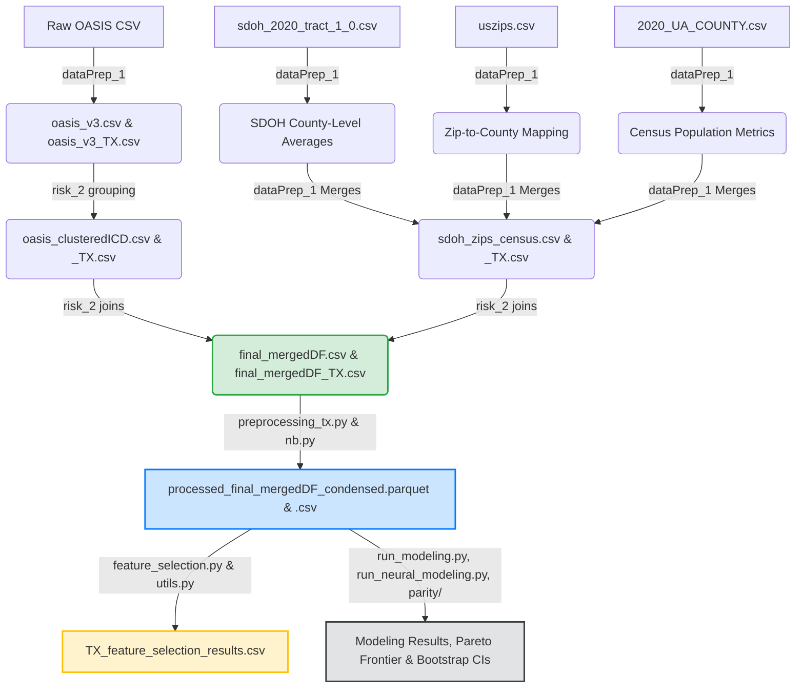
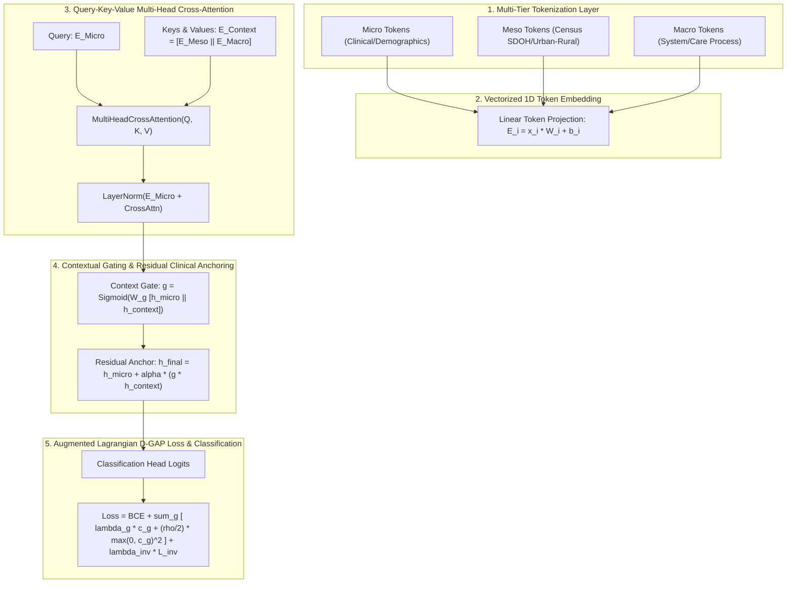

# OASIS Home Health & SDOH Integration Pipeline: Comprehensive Methodology Report

**Date**: August 13, 2026  
**Environment**: Texas State LEAP2 HPC Cluster (`spark_env`, Slurm Workload Manager)  
**Target Datasets**: OASIS Home Health & Census SDOH Integrated Datasets (`final_mergedDF_TX.csv`, `final_mergedDF.csv`)  

---

## 1. High-Level Pipeline Architecture

Below is the end-to-end data pipeline from raw home health files to PySpark preprocessing, Parquet generation, multi-algorithm feature selection, and unified machine learning / ACT-Parity v2 modeling.

---

## 2. Component Methodology

### Step 1: Raw Preprocessing & Cohort Extraction
* **Files**: `preprocessing_orgOASIS.py`, `dataPrep_1.ipynb`, `dataPrep_1-TX.ipynb`
* **Data Sources**: 
  - Raw Patient Data: `../OASIS/OASIS_BASE_FILE_031822.csv`
  - SDOH Data: `data/sdoh_2020_tract_1_0.csv`
  - US Zip Codes: `data/uszips.csv`
  - US County Census (2020): `../data/2020_UA_COUNTY.csv` (`POP_URB`, `POPPCT_URB`, `POP_RUR`, `POPPCT_RUR`)
* **Methodology**:
  1. **Cohort Separation**: Extracts the general cohort (`dataPrep_1.ipynb`) and filters for the Texas cohort (`dataPrep_1-TX.ipynb`), exporting them to `oasis_v3.csv` / `oasis_v3_TX.csv`.
  2. **Renaming & Feature Derivation**: Maps OASIS codes (`M0066`, `M0069`) to readable columns (`Patient_Birth_Date`, `Gender`). Calculates patient-level variables including `Age` at assessment, mapped clinical disciplines (`RN`, `PT`, `OT`), and duration of care (`Days_Cared_For`).
  3. **Geographical Merging**: SDOH tract variables are averaged at the county level. The `uszips.csv` file maps patient zip codes to counties, which are then combined with county-level Census population stats. Saved as `sdoh_zips_census.csv` / `sdoh_zips_census_TX.csv`.

### Step 2: ICD Grouping & Final Integration
* **Files**: `risk_2.ipynb`, `risk_2-TX.ipynb`
* **Methodology**:
  1. **ICD Code Clustering**: Group diagnoses into specific clinical clusters (`Primary_Diagnosis_ICD_10_C_M_Code_Cluster`, `Other_Diagnosis_Code_X_...`), saving output to `oasis_clusteredICD.csv` / `oasis_clusteredICD_TX.csv`.
  2. **Final Left Joins**: Merges clustered patient records with consolidated geographical SDOH/Census files based on zip and county coordinates.
  3. **Output**: Generates integrated datasets: `data/final_mergedDF.csv` (all-states, 2.86M rows) and `data/final_mergedDF_TX.csv` (Texas-only, 233k rows).

### Step 3: Urban/Rural Classification & Clinical Analysis
* **Files**: `urban_rural.ipynb`, `run_urban_rural_modeling.py`, `run_urban_rural_neural_modeling.py`
* **Methodology**:
  1. **Rule-Based Classification**: Uses Census pop counts (`POPPCT_URB`, `POPPCT_RUR`) and RUCA codes to classify patient records:
     - **Urban**: $\ge 50\%$ urban population or RUCA Category 1.
     - **Rural**: $\ge 50\%$ rural population or RUCA Categories 2/3.
  2. **Subgroup Execution**: Evaluates all 6 baseline ML models and all 4 PyTorch Neural architectures across Urban and Rural sub-cohorts (*Texas Urban, Texas Rural, Nationwide Urban, Nationwide Rural*).
  3. **Stratified Sampling**: Nationwide urban/rural cohorts are evaluated on a **50% stratified sample** (`train_size=0.50`), while Texas cohorts remain at 100% full dataset size.

### Step 4: Large-Scale PySpark & Parquet Preprocessing Engine
* **Files**: `preprocessing_tx.py`, `preprocessing_nb.py`, `preprocessing_tx_condensed.py`, `preprocessing_nb_condensed.py`, `preprocessing.slurm`, `preprocessing_cpu_condensed.slurm`
* **Methodology**:
  1. **Positional Schema Resolution**: Replaced sequential column renames with set-based collision tracking (`seen` set) in `make_column_names_descriptive()` and positional `.toDF(*unique_cols)` casting, eliminating PySpark Catalyst `AnalysisException` symbol errors.
  2. **Native Binary Parquet Export**: Integrated native `.parquet` export alongside `.csv`. Parquet columnar formatting compresses data storage and accelerates downstream modeling load times by over 10x.
  3. **Batched PySpark Constant Column Identification**: Replaced monolithic distinct aggregations with batched 100-column `df.agg(*exprs)` loops, preventing Catalyst plan explosions and driver garbage collection OOM crashes.
  4. **Output**: Generates `data/processed_final_mergedDF_condensed_TX.parquet` and `data/processed_final_mergedDF_condensed.parquet`.

### Step 5: Parallel Feature Selection Pipeline
* **Files**: `featureSelection/feature_selection.py`, `featureSelection/run_cohort_urban_rural_fs.py`, `featureSelection/fs.slurm`
* **Methodology**:
  1. **Parquet-First Loading**: Configured feature selection scripts to prioritize `.parquet` inputs directly via `pd.read_parquet()`.
  2. **Parallel Cohort Execution**: Wrapped Texas and Nationwide feature selection in `concurrent.futures.ThreadPoolExecutor(max_workers=2)`, evaluating all modeling features across 7 distinct feature selection algorithms (Lasso L1, Variance Threshold, Random Forest Gini, LightGBM, XGBoost, Permutation Importance, and HIR Self-Attention).
  3. **Output**: Exports `featureSelection/results/TX_feature_selection_results.csv`.

### Step 6: Unified Machine Learning & Neural Modeling Framework
* **Files**: `modeling/models.py`, `modeling/run_modeling.py`, `modeling/run_neural_modeling.py`, `explore_ensemble_ratios.py`, `explore_neural_ensemble_ratios.py`, `parity/`
* **Methodology**:
  1. **Baseline ML Models**: LightGBM, XGBoost, CatBoost, Random Forest, Gradient Boosting, L1/L2 Logistic Regression. Hyperparameters are tuned via 3-fold cross-validation with `scoring='f1'` and saved to `{cohort}_best_hyperparameters.json`.
  2. **PyTorch Neural Models**: Standard MLP, Standard Tabular Transformer, SAINT Transformer (Self & Intersample Attention), and HIR-M3 Tabular Transformer. Tuned hyperparameters are saved to `{cohort}_neural_best_hyperparameters.json`.
  3. **Transformer Feature Subsetting**: For memory safety under quadratic attention ($\mathcal{O}(N^2)$), feature space for Tabular Transformers is subsetted to the top 200 highest-variance features.
  4. **Ensemble Ratio Exploration**: Systematically explores 11 linear blend ratios ($w_1 \cdot P_{\text{Base}} + w_2 \cdot P_{\text{HIR-M3}}$ across ratios `100:0`, `90:10`, ..., `0:100`). Demonstrates that a **70% XGBoost : 30% HIR-M3 Transformer** blend achieves optimal balance (**F1 0.4878**, **ROC-AUC 0.8258**).
  5. **Validation-Tuned Decision Thresholding (Zero Test Leakage)**: To prevent optimistic bias, classification decision thresholds ($\tau_{\text{val}}^*$) are strictly fitted on an 80/20 train/validation split ($\mathcal{D}_{\text{val}}$) of the training data. The fitted threshold is then evaluated on the completely held-out test set ($\mathcal{D}_{\text{test}}$).

---

## 3. Evaluation Rigor & Leakage Protection

### A. Validation-Tuned vs. Threshold-Independent Metrics
To ensure zero test-set leakage, evaluation metrics are categorized into two rigorous classes:

1. **Threshold-Independent Metrics (Strict Held-Out Ground Truth)**:
   * **ROC-AUC** (Receiver Operating Characteristic Area Under Curve)
   * **PR-AUC** (Precision-Recall Area Under Curve / Average Precision)
   * **Brier Score** (Probabilistic Calibration MSE)
   * These metrics evaluate continuous prediction probabilities across all possible cutoffs and are inherently free from threshold selection bias.

2. **Validation-Tuned Threshold-Dependent Metrics (Held-Out Estimates)**:
   * **F1-Score**, **Precision**, **Sensitivity (Recall)**, **Specificity**, **Accuracy**
   * Optimal classification threshold $\tau_{\text{val}}^*$ is fitted strictly on validation predictions ($\mathcal{D}_{\text{val}}$):
     $$\tau_{\text{val}}^* = \arg\max_{\tau \in (0, 1)} \text{F1}\left(y_{\text{val}}, \hat{P}_{\text{val}} \ge \tau\right)$$
   * $\tau_{\text{val}}^*$ is applied to held-out test predictions ($\mathcal{D}_{\text{test}}$) to report un-biased held-out performance.

### B. Algorithmic Equity & HIR-M3 Interpretability Metrics
All equity audit functions are centralized in `parity/equity_metrics.py` and `parity/metrics.py`:

* **Fairness-Adjusted Performance Index ($\text{FAPI}_{\alpha}$)**:
  $$\text{FAPI}_{\alpha} = \text{F1}_{\text{overall}} \times \left(1 - \alpha \cdot \max_{g_1, g_2} |\text{F1}_{g_1} - \text{F1}_{g_2}|\right)$$
* **Subgroup Expected Calibration Error ($\text{S-ECE}$)**: Measures calibration consistency per demographic and rural subgroup.
* **Hierarchical Attention Flow Ratio ($\text{HAFR}$)**:
  $$\text{HAFR} = \frac{\text{Mean}\left(\mathbf{A}[\text{Meso} \rightarrow \text{Micro}]\right)}{\text{Mean}\left(\mathbf{A}[\text{Micro} \rightarrow \text{Micro}]\right)}$$
* **Subgroup Feature Attention Divergence ($\text{SFAD}$)**: Measures cosine divergence of attention vectors across racial groups ($1 - \cos(\bar{\mathbf{a}}_{g_1}, \bar{\mathbf{a}}_{g_2})$).

---

## 4. The ACT-Parity v2 Architecture & Mathematical Formulation

### A. Mathematical Formulation
1. **Context Representation**: Concatenate structural tokens $\mathbf{C} = [\mathbf{E}_{\text{Meso}} \,\|\, \mathbf{E}_{\text{Macro}}] \in \mathbb{R}^{B \times (N_{\text{meso}} + N_{\text{macro}}) \times D}$.
2. **Cross-Attention Output**:
   $$\mathbf{A}_{\text{context}} = \text{MultiHeadAttention}\left(Q = \mathbf{E}_{\text{Micro}}, \, K = \mathbf{C}, \, V = \mathbf{C}\right)$$
3. **Contextual Gate**:
   $$\mathbf{g} = \sigma\left(\mathbf{W}_{\text{gate}} \left[ \bar{\mathbf{e}}_{\text{Micro}} \,\|\, \bar{\mathbf{c}} \right] \right) \in \mathbb{R}^{B \times 1}$$
4. **Residual Clinical Anchor Path**:
   $$\mathbf{h}_{\text{final}} = \bar{\mathbf{e}}_{\text{Micro}} + \alpha \cdot \mathbf{g} \odot \bar{\mathbf{a}}_{\text{context}}$$
   where $0 \le \alpha \le 1$ is tuned on validation data.

### B. Augmented Lagrangian D-GAP Loss
$$\mathcal{L}_{\text{Total}} = \mathcal{L}_{\text{BCE}} + \sum_{g \in G_{\text{supported}}} \left[ \lambda_g c_g + \frac{\rho}{2} \max(0, c_g)^2 \right] + \lambda_{\text{inv}} \mathcal{L}_{\text{inv}}$$

* **Soft Subgroup FNR**: $\widetilde{\text{FNR}}_g = 1 - \frac{1}{n_g^+} \sum_{i: y_i=1, a_i=g} \sigma(z_i)$
* **Clinical Constraint**: $c_g = \widetilde{\text{FNR}}_g - (\widetilde{\text{FNR}}_{\text{all}} + \delta) \le 0$ ($\delta = 0.04$)
* **Epoch-Level Multiplier Update**: $\lambda_g^{(t+1)} \leftarrow \max(0, \lambda_g^{(t)} + \eta \cdot c_g^{(t)})$

---

## 5. LEAP2 Slurm Specifications

### Slurm Execution Specs (`preprocessing.slurm`, `fs.slurm`, `run_parity.slurm`, `run_unified_parity.slurm`)
- **CPUs & Memory**: Configured `#SBATCH --cpus-per-task=8` and `#SBATCH --mem=64Gb` with 24-hour walltime.
- **Environment**: Activated PySpark `spark_env` with thread limits (`OMP_NUM_THREADS=8`, `MKL_NUM_THREADS=8`).
- **Dependencies**: Includes `pyspark`, `torch`, `pyarrow`, `fastparquet`, `lightgbm`, `xgboost`, `catboost`, `scikit-learn`, `pandas`, `numpy`, and `joblib`.
